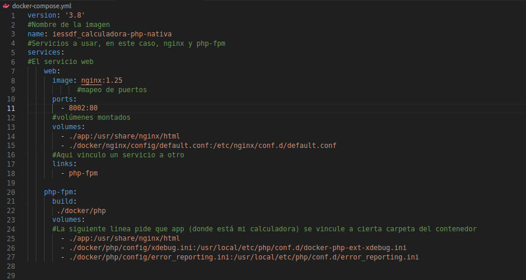
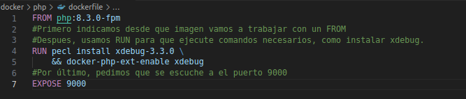
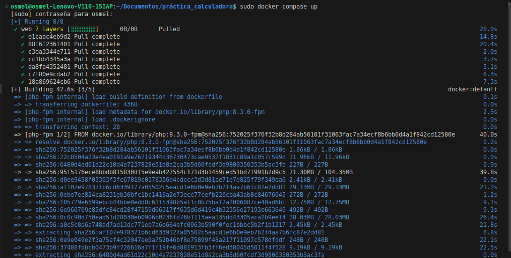
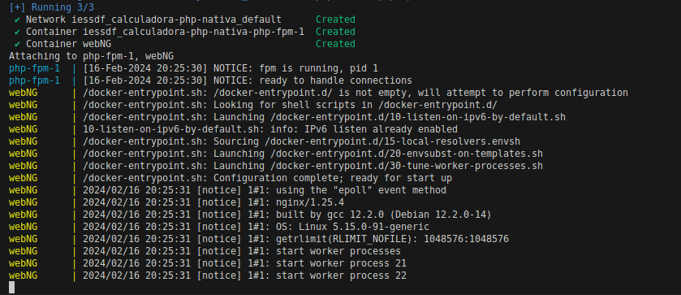
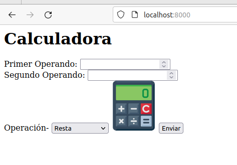
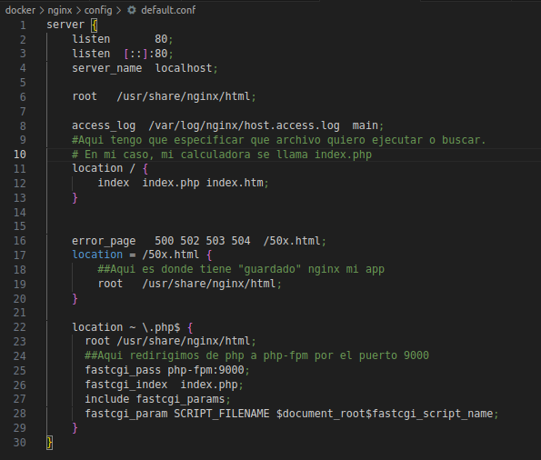
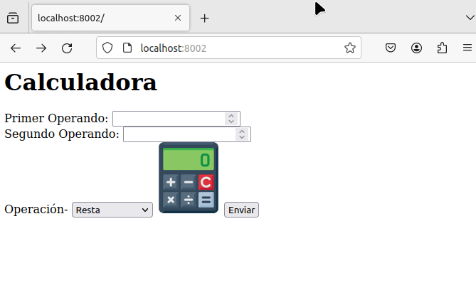

# Práctica Docker-compose Osmel
## Paso 1: Crear el docker compose YML
 

## Paso 2: Crear el dockerfile
 
Creado un archivo compatible, procedemos a levantarlo con compose

## Paso 3: Configurar nginx
 
Configurado, levantamos y vemos si funciona
  

## Paso 4: Al comprobar que funciona, probamos a hacer debug

## --NOTAS--
1.-Debido a que el ordenador ha decidido tener un kernel panic en medio de la tarea, la aplñicacion se ejecutaba en el puerto 8000, pero se bloqueó y ahora solo funciona en el puerto 8002 (de ahi que el primer screenshot salga con otro puerto)
2.-Debido a lo mismo, el equipo se niega a que Docker se comunique correctamente, así que el ultimo gif (el de debug) está hecho desde el equipo de Verónica con mi contenedor (Linux Mint y Ubuntu)
