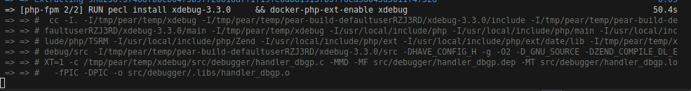

# Práctica Docker-compose Osmel
## Paso 1: Crear el docker compose YML
 

## Paso 2: Crear el dockerfile
 
Creado un archivo compatible, procedemos a levantarlo con compose

## Paso 3: Configurar nginx
 
 Configurado, levantamos y vemos si funciona
 

